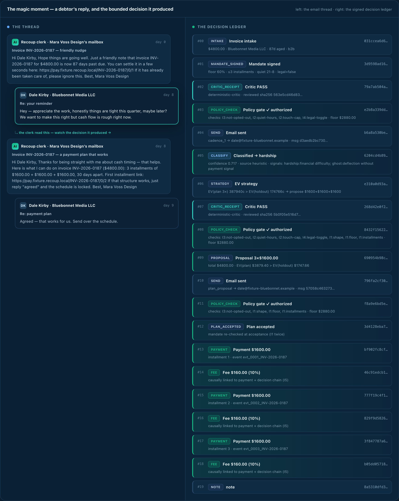
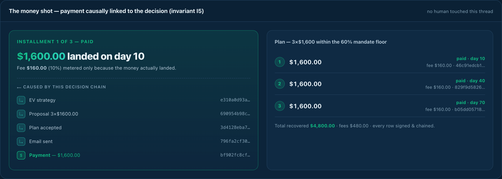
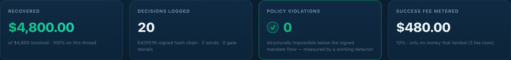
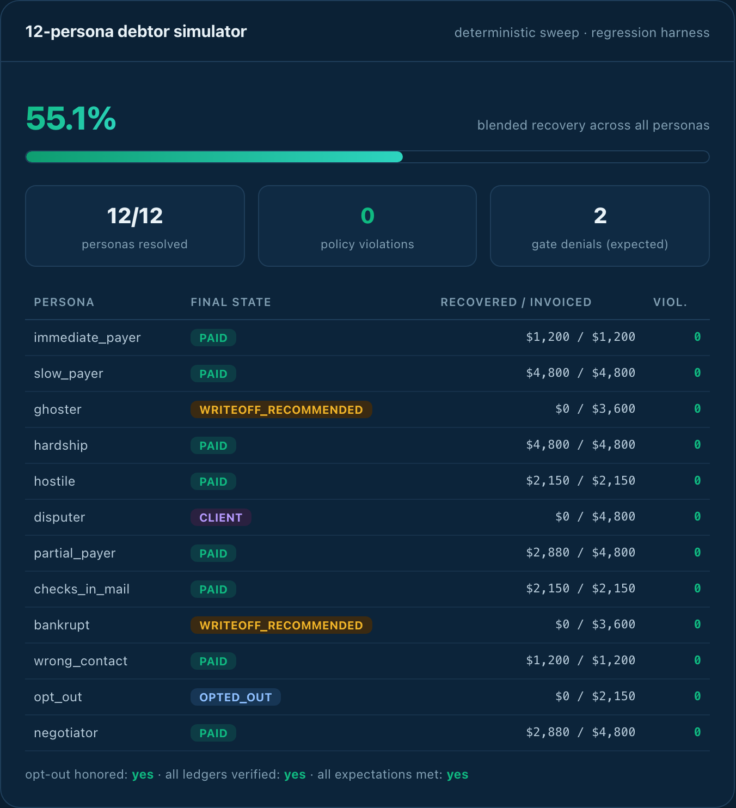
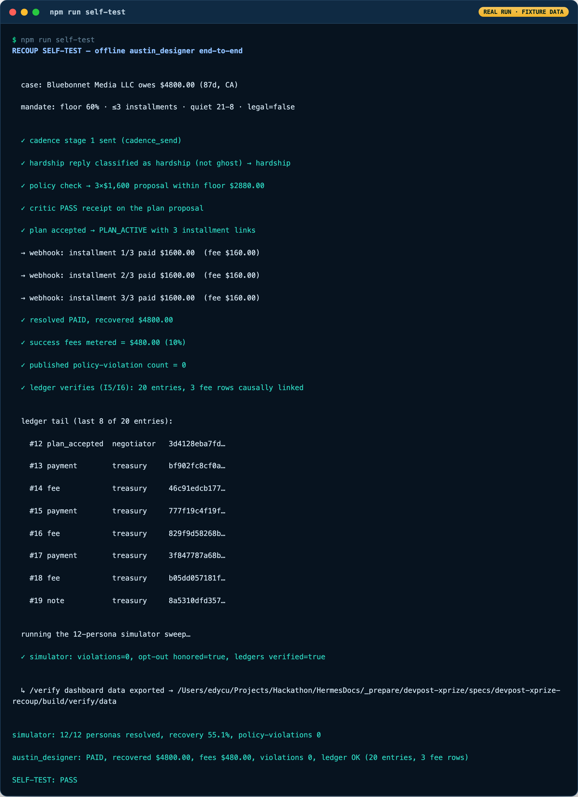
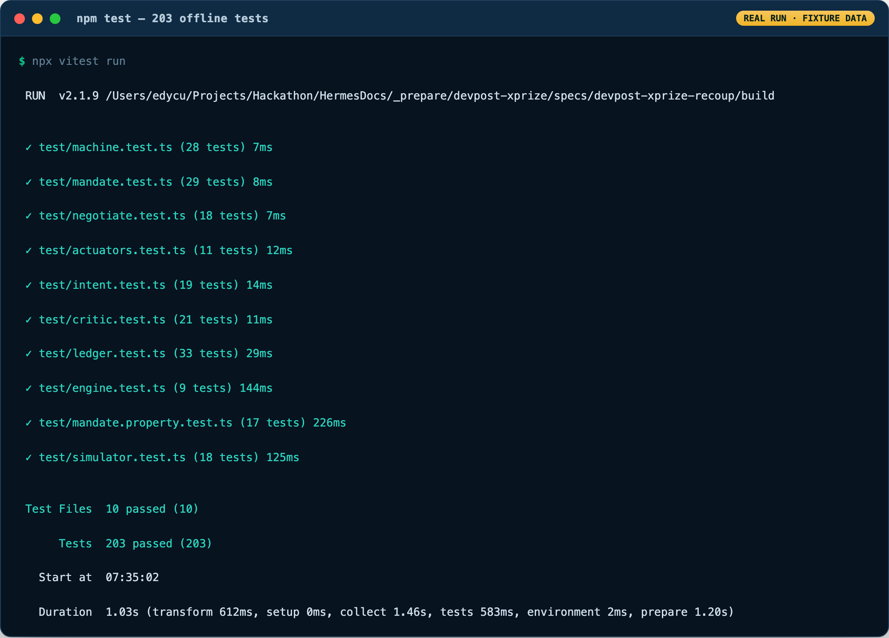

<div align="center">

# Recoup — `@recoup/dunningkit-core` 📩➰💵

**Problem:** freelancers lose weeks and relationships chasing overdue invoices; collection agencies take 25–50% and torch the client.
**Solution:** an AI accounts-receivable clerk that chases invoices **from the freelancer's own mailbox**, negotiates installment plans **within a floor the client signs**, takes payment via Stripe, and charges 10% only when money lands — every customer-visible action a **signed, ledgered AI decision**.
**What's built (this repo):** the deterministic, fully-offline **core** — an agent with *bounded money authority* whose policy violations are **provably 0**, proven by **203 passing tests** with **no network and no real keys**.


-10B981?style=for-the-badge)


</div>

> Recoup is an AI accounts-receivable clerk that chases a freelancer's overdue invoices
> **from the freelancer's own mailbox**, negotiating installment plans **within a floor the
> client signs**, taking payment via Stripe, and charging 10% only when money lands — with
> every customer-visible action a signed, ledgered AI decision.

This package is the **deterministic, fully-offline core**: the escalation state machine,
the settlement-mandate middleware (the economic primitive), the signed decision ledger,
the intent classifier, the negotiation engine, the compliance critic, the actuator seams
(in-memory fakes), and a 12-persona debtor simulator. **No network, no real keys, no live
money** — everything here runs and is proven under `vitest`. `COMPLEXITY.md` (in the parent
spec folder) is the binding blueprint.

---

## 🎯 For Judges — 60-second quickstart

```bash
npm install
npm run ci             # typecheck (strict) + 203 tests + full proof stage, one command
```

Or run the evidence pieces individually:

```bash
npm test               # 203 tests, all offline & deterministic
npm run typecheck      # tsc --noEmit, strict
npm run self-test      # the money shot: austin_designer hardship → 3×$1,600 plan → 3 paid → PASS
npm run verify-ledger  # standalone chain/sig/Merkle/I5 verifier over a generated demo ledger
npm run seed:check     # re-hash guard: the synthetic fixtures are reproducible
npm run bench          # per-stage p50/p95 (offline component latency)
```

**👁️ The judge-visibility layer — see the proof, don't just read it:**

```bash
npm run verify:dashboard   # re-run self_test, then rebuild the /verify replay page from its real output
open verify/index.html     # the /verify replay: thread ↔ decision ledger, money shot, violations 0, Merkle
                           # (single self-contained file; opens straight from file://, no server)

npx tsx src/cli.ts --help                                        # the unified `dunningkit` CLI
npx tsx src/cli.ts simulate --persona hardship --floor 60        # one persona through the machine
npx tsx src/cli.ts interest --state CA --days 87 --amount 4800   # statutory late-interest
npx tsx src/cli.ts verify verify/data/ledger.jsonl              # standalone chain/Merkle/I5 verify

npm run evidence           # capture ≥15 live-execution PNGs → docs/evidence/
```

**`self-test` is the magic moment as a script.** An ambiguously-worded hardship reply
(`"things are tight this quarter, maybe later?"`) is classified as **hardship** (not
ghosting), checked against the signed mandate, turned into a **3×$1,600** plan, passed by
the compliance critic, accepted, paid across three fake Stripe webhooks, and metered at a
**$480 (10%)** success fee — then the signed ledger verifies (`20 entries, 3 fee rows
causally linked`) and the 12-persona simulator confirms **policy-violations = 0**. Expected tail:

```
simulator: 12/12 personas resolved, recovery 55.1%, policy-violations 0
austin_designer: PAID, recovered $4800.00, fees $480.00, violations 0, ledger OK (20 entries, 3 fee rows)
SELF-TEST: PASS
```

> **Honest status:** the offline **`/verify` replay dashboard**, the unified **`dunningkit` CLI**,
> and **17 live-execution evidence screenshots** are now built — they render/report the *real*
> output of a deterministic `self_test` run (see "See it in action" below). What is **still not
> live**: real Gmail OAuth send, live Stripe money, real revenue, and Gemini inference — those
> live-plane pieces stay designed behind seams and scheduled in `BUILD_PLAN.md` (Weeks 1–6). The
> dashboard renders committed **FIXTURE** data and says so on the page.

---

## 👁️ See it in action — the `/verify` replay + live-execution evidence

The crown jewel — an agent with **bounded real-money authority**, the causal
**decision → money → fee** chain, **policy violations provably 0** — is no longer trapped in a
passing terminal log. Two judge-facing surfaces make it visible, both **fully offline and honest**:

- **`verify/index.html`** — a single self-contained `/verify` replay page (inline CSS+JS, no fetch,
  no external host, opens from `file://`). It renders the **real** ledger, simulator metrics, and a
  **pre-computed** verification report exported by `scripts/self_test.ts` to `verify/data/`. Rebuild
  it any time with **`npm run verify:dashboard`**. *(The chain verifier uses `node:crypto`, so the
  page shows a pre-computed result and hands you `npm run verify:ledger` to re-check it yourself.)*
- **`docs/evidence/`** — **17 PNGs** captured by `npm run evidence` (Playwright), every one a real
  artifact of a real run: the replay panels above plus terminal captures of `self_test`,
  `verify_ledger`, `bench`, the CLI, and the 203-test suite.

<p align="center">
  <br />
  <em>The magic moment — the debtor's <b>“cash flow is rough”</b> reply (left) and the bounded decision chain it produced (right): <code>classify → hardship</code> → <code>policy gate ✓ (floor 60% / ≤3)</code> → <code>propose 3×$1,600</code> → <code>critic PASS</code> → <code>sent</code>.</em>
</p>

<p align="center">
  <br />
  <em>The money shot — <b>Installment 1 of 3 — paid $1,600</b> causally linked back to the decision that produced it (invariant <b>I5</b>); the 10% fee is metered only because the money landed.</em>
</p>

<p align="center">
  <br />
  <em>The counter row from real <code>self_test</code> output: <b>$4,800 recovered · 20 decisions logged · policy violations: 0 · $480 fee metered</b>.</em>
</p>

<p align="center">
  <br />
  <em>The 12-persona simulator panel — <b>12/12 resolved, 55.1% blended recovery, 0 policy violations</b> across every persona.</em>
</p>

<p align="center">
  
  <br />
  <em>Real terminal captures: <code>npm run self-test</code> (simulator <b>violations 0</b>, <b>SELF-TEST: PASS</b>) and the <b>203</b>-test suite, green.</em>
</p>

---

## 🧪 Test suite — exact, real, no padding

**203 tests across 10 files** (`npm test`):

| File | Tests | Covers |
|---|---:|---|
| `test/machine.test.ts` | 28 | state-machine transitions, terminal absorption, I3 totality |
| `test/mandate.test.ts` | 29 | policy validation, quiet-hours math, proposal shape, floor rounding, denials/receipts |
| `test/mandate.property.test.ts` | 17 | **flagship**: randomized proof that below-floor / over-installment / quiet-hours / cap / legal actions are structurally impossible; `executedViolations` stays 0 |
| `test/ledger.test.ts` | 33 | canonical JSON, hash chain, Ed25519 sigs, Merkle, tamper detection, **I5** fee linkage (all violation modes) |
| `test/intent.test.ts` | 19 | hardship-vs-ghosting edge, intent coverage, two-stage classifier + mock adapter |
| `test/negotiate.test.ts` | 18 | statutory interest per state (CA/TX/NY), exact installment split, EV(plan) vs EV(holdout) |
| `test/critic.test.ts` | 21 | locked template registry, tone gate, legal-language toggle (I4), critic-gate interface |
| `test/actuators.test.ts` | 11 | send chokepoint: unforgeable token + receipt-hash match; Stripe/fee fakes |
| `test/engine.test.ts` | 9 | full loop end-to-end (hardship money shot, opt-out, dispute, bankrupt, ghost, quiet-hours, below-floor, hostile-block) |
| `test/simulator.test.ts` | 18 | 12-persona sweep: **violations = 0**, opt-out honored, ledgers verified, expectations met |

The flagship guarantee lives in `mandate.property.test.ts`: across ~300 randomized policies
per property, every below-floor / over-installment / out-of-quiet-hours / over-cap /
unauthorized-legal action is **denied at the gate** (no token issued ⇒ no actuator can act),
and the published `executedViolations` counter provably stays **0**. An honesty control feeds
a *known* breach to the audit hook and watches the counter tick to 1 — so "0" is a real
measurement by a working detector, not a vacuous constant.

## 🛡️ Engineering harness

Adapted for a backend **library** (there is no UI to serve yet, so the browser layers are
intentionally N/A):

| Layer | Tool | Status |
|---|---|---|
| Type safety | TypeScript 5, `strict` + `noUncheckedIndexedAccess` + `exactOptionalPropertyTypes` | ✅ `npm run typecheck` |
| Unit + property tests | Vitest (203 tests, 10 files) | ✅ `npm test` |
| Executable proof stage | `seed:check` (hash guard) + `self-test` (E2E) + `verify-ledger` (chain) | ✅ `npm run proof` |
| CI pipeline | GitHub Actions — Stage 1 typecheck+tests (Node 18/20/22) · Stage 2 proof · Stage 3 security | ✅ `.github/workflows/ci.yml` |
| Security (SAST) | CodeQL (`javascript-typescript`) | ✅ `.github/workflows/codeql.yml` |
| Security (secrets) | TruffleHog (`--only-verified`) | ✅ CI Stage 3 |
| Security (SCA) | Dependabot (npm + actions) + `npm audit` | ✅ advisory¹ |
| E2E / Performance / Lighthouse | — | N/A — no UI yet |

¹ `npm audit` runs advisory in CI: the currently-flagged items live entirely in the
`vitest`/`vite` **devDependency** chain (test-only, never shipped). The library's single
runtime dependency is `@google/genai`, lazy-loaded and only constructed when
`GEMINI_API_KEY` is set.

## 🔒 Invariants (COMPLEXITY §4) — where each is enforced and tested

| # | Invariant | Enforced in | Proven in |
|---|---|---|---|
| I1 | never below mandate floor / over max installments | `core/mandate` (`authorize`) | mandate.property, mandate, negotiate, engine |
| I2 | never outside quiet hours / cadence caps | `core/mandate` (`inQuietHours`, touch cap) | mandate.property, mandate, engine (deferral) |
| I3 | opt-out halts within one tick, permanently | `core/machine` (absorbing `OPTED_OUT`) + `core/mandate` (`I3_OPT_OUT`) | machine, mandate.property, engine, simulator |
| I4 | every send has a passed compliance-critic receipt | `core/critic` + `core/actuators` (receipt-hash gate) | critic, actuators, engine |
| I5 | every fee row links to a payment event AND its decision chain | `core/ledger` (`verifyChain`) + `core/engine` (`linkRefs`) | ledger, engine, `verify_ledger.ts` |
| I6 | ledger integrity (hash chain + sigs + Merkle) | `core/ledger` | ledger |

## 🗺️ Module map → COMPLEXITY.md (with relative complexity)

| Module | COMPLEXITY § | Role | Complexity |
|---|---|---|:--:|
| `src/core/mandate` | §3 | settlement-mandate middleware — the product's economic primitive; unforgeable single-use authorization tokens (a `WeakSet` no forgery can enter) | 🔴 High |
| `src/core/ledger` (+`canonical`) | §2 | append-only Ed25519-signed hash chain, daily Merkle roots, canonical JSON, standalone verifier, I5 causal fee-linkage | 🔴 High |
| `src/core/engine` (+`drafts`) | §1 | `RecoupEngine` — the full loop, wiring every component + ledgering every action + threading decision refs into every payment link | 🔴 High |
| `src/core/machine` | §4 | escalation state machine `INTAKE→CADENCE→{NEGOTIATING↔AWAITING}→{PLAN_ACTIVE→PAID \| DISPUTED→CLIENT \| WRITEOFF \| OPTED_OUT}`; I3 absorbing by construction | 🟠 Medium |
| `src/core/negotiate` (+`rulepacks`) | §3 | installment EV vs holdout, statutory late-interest rulepacks (CA/TX/NY, FIXTURE), exact-sum installment split | 🟠 Medium |
| `src/core/critic` (+`templates`) | §1/§4 | compliance critic (tone/legal gate) + frozen hash-pinned template registry | 🟠 Medium |
| `src/core/intent` (+`gemini`) | §1 | reply-intent classifier (offline heuristic; Gemini Flash adapter behind a seam) | 🟠 Medium |
| `src/core/simulator` (+`personas`) | §5 | 12 deterministic debtor personas + nightly-eval runner (recovery / time-to-resolution / violation metrics) | 🟢 Low |
| `src/core/actuators` | §2 | Gmail/Stripe/fee-meter ports + in-memory fakes; the send chokepoint | 🟢 Low |
| `src/core/fixtures` | SEED_DATA | synthetic invoices, mandate, and scripted reply corpus | 🟢 Low |
| `scripts/` | §5/§2 | `seed` · `self_test` · `verify_ledger` · `bench` | 🟢 Low |

## ✅ Status — Implemented / Stubbed / Not-started (honest)

**Implemented (real code, tested offline):**

- Escalation state machine with audited transition table (I1–I6 shape, I3 absorbing).
- Settlement-mandate middleware: structural I1/I2/I3/I4 enforcement, unforgeable single-use
  tokens, `executedViolations` counter (proven 0).
- Signed decision ledger: canonical-JSON hash chain, Ed25519 signatures, daily Merkle roots,
  standalone `verifyChain`, and the I5 causal fee-linkage.
- Intent classifier (offline heuristic) clearing the hardship-vs-ghosting edge; two-stage
  classifier with a deterministic mock adapter.
- Negotiation EV engine + statutory rulepacks (CA/TX/NY, clearly marked FIXTURE).
- Compliance critic (deterministic) + frozen, hash-pinned template registry.
- `RecoupEngine`: the complete offline loop (cadence → classify → strategy → gate → critic →
  fake send → fake Stripe webhook → fee metering), every action ledgered.
- Actuator fakes with the real send chokepoint (token + receipt-hash + msg_sha256).
- 12-persona deterministic debtor simulator (recovery/time-to-resolution/violation metrics).
- Scripts: `seed.ts --check`, `self_test.ts`, `verify_ledger.ts`, `bench.ts`.
- Engineering harness: strict `tsconfig`, CI (typecheck+tests+proof+security), CodeQL,
  Dependabot, MIT `LICENSE`.

**Stubbed / seam-only (interface present + deterministic offline impl; production swaps in):**

- `src/core/intent/gemini.ts` — real `@google/genai` wiring behind `IntentAdapter`; only
  constructed when `GEMINI_API_KEY` is set. The offline test path never imports it.
- Gemini compliance critic — same `CriticAdapter` seam; offline uses `DeterministicCritic`.
- Statute rulepacks — 3 FIXTURE states; production replaces with the nightly 50-state crawl.

**Not started / deferred (out of scope for this offline-core session):**

- The **live, public** `/verify` over production data + the full client dashboard/onboarding web
  app. *(An offline `/verify` **replay** over committed fixture data is now built —
  `verify/index.html`, `npm run verify:dashboard`.)*
- Live Gmail OAuth + delegated first-party send (KMS-wrapped token vault).
- Live Stripe payment links, webhooks, and Connect-style fee accounting.
- Real Gemini inference (Flash classifier / Pro negotiator).
- BigQuery marts, Cloud Run/Tasks/Scheduler, the dossier agent (r.jina.ai), the acquisition
  loop, and publishing `@recoup/dunningkit` to npm.

## 📁 Project structure

```
build/
├── src/core/
│   ├── mandate/      # settlement-mandate middleware (the economic primitive)
│   ├── ledger/       # Ed25519 hash-chain + canonical JSON + Merkle + I5 verifier
│   ├── engine/       # RecoupEngine: the full loop (+ drafts.ts)
│   ├── machine/      # escalation state machine
│   ├── negotiate/    # EV engine + statutory rulepacks
│   ├── critic/       # compliance critic + frozen template registry
│   ├── intent/       # heuristic classifier + Gemini seam (gemini.ts)
│   ├── simulator/    # 12 debtor personas + eval runner
│   ├── actuators/    # Gmail/Stripe/fee ports + in-memory fakes
│   ├── fixtures.ts   # SYNTHETIC invoices, mandate, reply corpus
│   ├── cli.ts        # `dunningkit` unified CLI (simulate · interest · verify · self-test · bench)
│   └── types.ts      # shared domain types (Cents, Clock, MandatePolicy, …)
├── scripts/          # seed · self_test (also exports verify/data) · verify_ledger · bench
│                     #   · build_dashboard · capture_evidence
├── verify/           # /verify replay: index.html (self-contained) + data/ (real self_test output)
├── docs/evidence/    # ≥15 live-execution PNGs from `npm run evidence`
├── test/             # 10 vitest files, 203 tests
├── .github/          # ci.yml · codeql.yml · dependabot.yml
└── README.md         # you are here
```

## 📝 Notes

- **All fixture data is SYNTHETIC.** No real debtor, client, or invoice appears here, and no
  real mailbox is contacted. B2B trade receivables only (consumer debt is refused at intake).
- Determinism is a design goal: an injected `Clock`, a seeded PRNG in property tests, scripted
  persona replies, and canonical JSON make every run reproducible and every failure debuggable.
- Money is integer USD cents end-to-end; no float ever crosses a money boundary.

## 📄 License

[MIT](LICENSE) © 2026 Edy Cu
